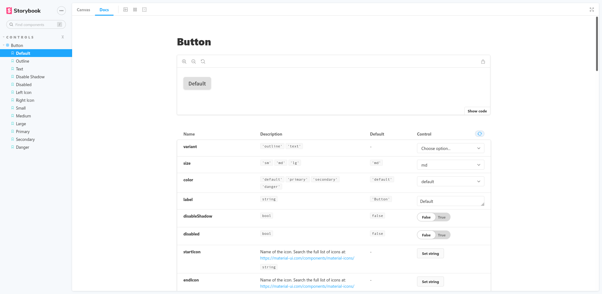

<!-- markdownlint-disable MD033 -->

<h1 align="center">
  
  Button Component
</h1>

<div align="center">
   Solution for a challenge from  <a href="http://devchallenges.io" target="_blank">Devchallenges.io</a>.
</div>

<div align="center">
  <h3>
    <a href="https://button-component-nathan22x3.surge.sh">
      Demo
    </a>
    <span> | </span>
    <a href="">
      Solution
    </a>
    <span> | </span>
    <a href="https://devchallenges.io/challenges/f4NJ53rcfgrP6sBMD2jt">
      Challenge
    </a>
  </h3>
</div>

<!-- TABLE OF CONTENTS -->

## Table of Contents

- [Table of Contents](#table-of-contents)
- [Overview](#overview)
  - [Built With](#built-with)
- [Features](#features)
- [How To Use](#how-to-use)
- [Plugins](#plugins)
- [Contact](#contact)

<!-- OVERVIEW -->

## Overview



### Built With

- [React](https://reactjs.org/)
- [Tailwind](https://tailwindcss.com/)
- [Storybook](https://storybook.js.org/)

## Features

This application/site was created as a submission to a [DevChallenges](https://devchallenges.io/challenges) challenge. The [challenge](https://devchallenges.io/challenges/mM1UIenRhK808W8qmLWv) was to build an application to complete the given user stories.

- [x] **User story**: You can see different button types: default, outline and text
- [x] **User story**: You can choose to disable box-shadow
- [x] **User story**: You can choose to disable the button
- [x] **User story**: You can choose to have an icon on the left or right
- [x] **User story**: You can have different button sizes
- [x] **User story**: You can have different colors
- [x] **User story**: When you hover or focus, you can see visual indicators
- [x] **User story**: You can still access all button attributes

## How To Use

<!-- Example: -->

To clone and run this application, you'll need [Git](https://git-scm.com) and [Node.js](https://nodejs.org/en/download/) (which comes with [npm](http://npmjs.com)) installed on your computer. From your command line:

```bash
# Clone this repository
$ git clone https://github.com/nathan22x3/button-component

# Move to project directory
$ cd button-component

# Install dependencies
$ yarn

# Run the app
$ yarn start
```

## Plugins

- [twin.macro](https://github.com/ben-rogerson/twin.macro)

## Contact

- GitHub [@nathan22x3](https://github.com/nathan22x3)
